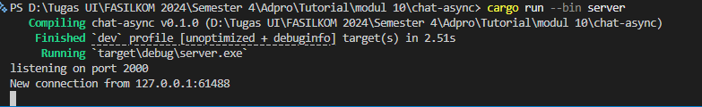
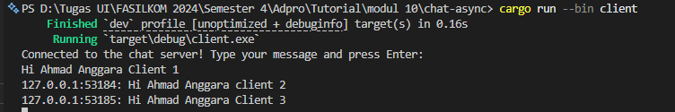
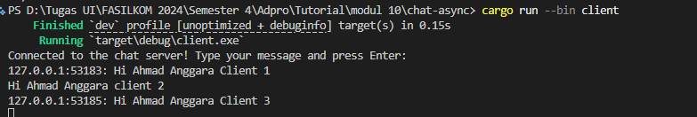
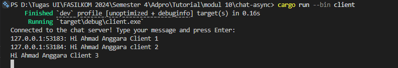
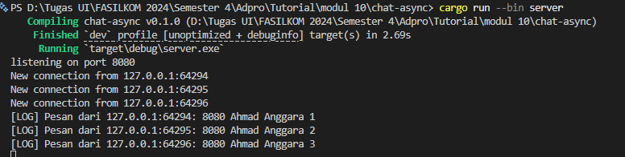
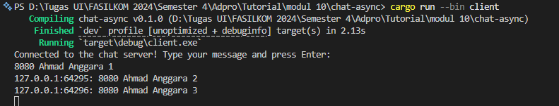
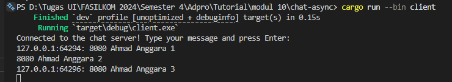
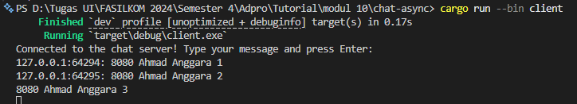

# Aplikasi Chat Broadcast Asinkron (Modul 10)

Aplikasi ini merupakan sistem obrolan berbasis protokol WebSocket yang dibangun menggunakan ekosistem asinkron `tokio` dan `tokio_websockets` di Rust. Sistem ini mengimplementasikan server pusat yang mendengarkan koneksi masuk dan mendistribusikan pesan secara real-time ke seluruh klien yang terhubung menggunakan saluran *broadcast*.

### Cara Menjalankan Aplikasi

1. **Jalankan Server:**
   Buka terminal utama Anda, pastikan berada di dalam direktori `chat-async`, lalu jalankan server terlebih dahulu:
   ```bash
   cargo run --bin server
   ```

2. **Jalankan Client:**
    Buka tiga jendela terminal baru secara terpisah, lalu jalankan perintah berikut pada masing-masing terminal untuk membuka tiga klien:
    ```bash
    cargo run --bin client
    ```

Ketika salah satu klien mengetik sebuah pesan di terminalnya lalu menekan tombol Enter, fungsi asinkron tokio::select! pada klien akan langsung menangkap baris teks tersebut melalui stdin. Pesan ini kemudian dibungkus menjadi frame WebSocket dan dikirimkan menuju server pusat.

Seketika setelah server menerima pesan tersebut, server akan memformat teks dengan menyertakan alamat IP asal (SocketAddr) dan menyebarkannya (broadcast) ke seluruh instans klien yang sedang aktif. Berdasarkan modifikasi opsional yang telah diimplementasikan, server secara cerdas akan mengecek identitas pengirim terlebih dahulu; pesan hanya akan diteruskan ke terminal klien-klien lain dan tidak akan dipantulkan kembali ke terminal pengirim asli demi menjaga kebersihan log obrolan.






---

### Eksperimen 2.2: Modifikasi Port WebSocket

Untuk mengubah port aplikasi menjadi `8080`, perubahan harus dilakukan pada kedua sisi sistem yang saling terhubung:
1. **Sisi Server (`src/bin/server.rs`):** Mengubah parameter alamat pengikatan (*binding*) pada fungsi `TcpListener::bind` dari `"127.0.0.1:2000"` menjadi `"127.0.0.1:8080"`. Modifikasi ini menginstruksikan server untuk membuka soket TCP baru dan mendengarkan lalu lintas masuk pada port 8080.
2. **Sisi Client (`src/bin/client.rs`):** Mengubah string URI target pada fungsi `ClientBuilder::from_uri` dari `"ws://127.0.0.1:2000"` menjadi `"ws://127.0.0.1:8080"`. Hal ini memastikan klien mengarahkan jabat tangan (*handshake*) koneksinya ke port server yang baru.

Kedua file tersebut **menggunakan protokol WebSocket yang sama**. Skema protokol ini didefinisikan secara eksplisit di dalam kode sumber klien saat melakukan inisialisasi koneksi melalui `ClientBuilder`, yang ditandai dengan penggunaan prefix `ws://` (WebSocket) pada string URI statis yang dimasukkan. Di sisi server, protokol ini didefinisikan saat membungkus aliran data TCP mentah menggunakan pustaka `ServerBuilder::new().accept(socket).await` untuk mengekstrak dan memproses bingkai (*frame*) WebSocket.




