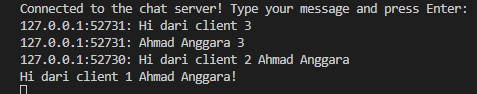

cargo run --bin client
   Berikut adalah draf isi file `README.md` dalam bahasa Indonesia. Penjelasannya sudah dibuat lebih detail, terstruktur, dan tidak *one-liner* agar mudah dipahami serta memenuhi kriteria tugas modul Anda.
```markdown
# Aplikasi Chat Broadcast Asinkron (Modul 10)

Aplikasi ini merupakan sistem obrolan berbasis protokol WebSocket yang dibangun menggunakan ekosistem asinkron `tokio` dan `tokio_websockets` di Rust. Sistem ini mengimplementasikan server pusat yang mendengarkan koneksi masuk dan mendistribusikan pesan secara real-time ke seluruh klien yang terhubung menggunakan saluran *broadcast*.

### Cara Menjalankan Aplikasi

1. **Jalankan Server:**
   Buka terminal utama Anda, pastikan berada di dalam direktori `chat-async`, lalu jalankan server terlebih dahulu:
   ```bash
   cargo run --bin server
   ```

2. **Jalankan Client:**
    Buka tiga jendela terminal baru secara terpisah, lalu jalankan perintah berikut pada masing-masing terminal untuk membuka tiga klien:
    ```bash
    cargo run --bin client
    ```

Ketika salah satu klien mengetik sebuah pesan di terminalnya lalu menekan tombol Enter, fungsi asinkron tokio::select! pada klien akan langsung menangkap baris teks tersebut melalui stdin. Pesan ini kemudian dibungkus menjadi frame WebSocket dan dikirimkan menuju server pusat.

Seketika setelah server menerima pesan tersebut, server akan memformat teks dengan menyertakan alamat IP asal (SocketAddr) dan menyebarkannya (broadcast) ke seluruh instans klien yang sedang aktif. Berdasarkan modifikasi opsional yang telah diimplementasikan, server secara cerdas akan mengecek identitas pengirim terlebih dahulu; pesan hanya akan diteruskan ke terminal klien-klien lain dan tidak akan dipantulkan kembali ke terminal pengirim asli demi menjaga kebersihan log obrolan.

